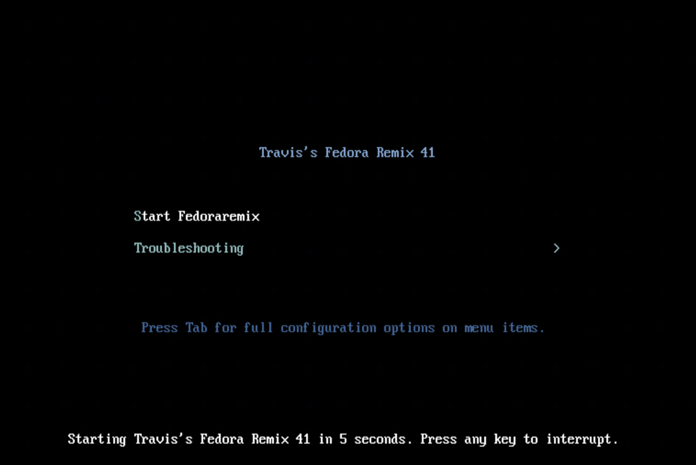

:icons: font
ifdef::backend-pdf[]
:title-page-background-image: image:images/Training_Cover.png[pdfwidth=8.0in,align=center]
:pygments-style: tango
:source-highlighter: pygments
endif::[]
ifndef::env-github[:icons: font]
ifdef::env-github[]
:status:
:outfilesuffix: .adoc
:caution-caption: :fire:
:important-caption: :exclamation:
:note-caption: :paperclip:
:tip-caption: :bulb:
:warning-caption: :warning:
endif::[]

== Fedora Remix Creation Quickstart

This quickstart will provide a quick method to download a pre-built Fedora Remix as well as creating your own Fedora Remix Building system. The https://github.com/tmichett/Fedora_Remix has been created with Ansible playbooks that will setup a Fedora Remix Building system using the Fedora Remix installed from the liveCD provided (https://drive.google.com/drive/folders/1UAT07AJIrTdMk3ke_QE6S6vz-qn6qGtR). The requirements are relatively simply to build and the system has Fedora Remix customization scripts and self-launching menu to assist with the initial setup. The quickstart and documentation are also available at the following link: https://tmichett.github.io/Fedora_Remix/.

.*Building your own Fedora Remix - Overview*

. Download the Fedora Remix ISO and install locally to hard drive
.. Setup a local user and ensure it is in the SUDOERS file
.. Run some the Fedora Remix customize scripts to create SSH keys and SUDO with no password
. Clone https://github.com/tmichett/Fedora_Remix
. Run the Ansible playbooks with the "sudo" command
.. Prepare_Web_Files.yml
.. Prepare_Fedora_Remix_Build.yml
. Modify the Kickstart files in */livecd-creator/FedoraRemix*
.. FedoraRemix.ks - To control various setup components and run commands
.. FedoraRemixPackages.ks - To control RPM packages that are installed as part of your Remix
. Run the *Remix_Build_Script.sh*

=== [blue]#*Quickstart*#

This quickstart provides detailed information on how to download, install, and create your custom Fedora Remix. It depends first on having the Fedora Remix installed locally and access to the Github repository and playbooks contained withing the repository.

. Download the "Latest" FedoraRemix LiveISO and create a bootable USB disk.
* https://drive.google.com/drive/folders/1UAT07AJIrTdMk3ke_QE6S6vz-qn6qGtR
** Use Balena Etcher or Fedora Media Writer to create the bootable USB device for installation on a physical machine.
** Attach the ISO image to your virtual machine and select it as the boot device so it can be installed

. Insert the disk into a computer or connect to the virtual machine and select 

