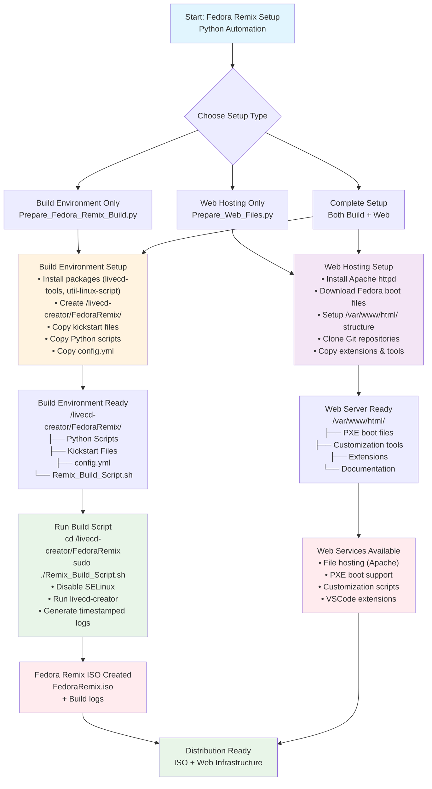

# Fedora Remix Python Automation Scripts Usage Guide

This guide provides comprehensive documentation for the Fedora Remix build system's Python automation scripts, which work together to create custom Fedora Live ISOs and set up web hosting for distribution.

## Table of Contents

1. [Overview](#overview)
2. [Prerequisites](#prerequisites)
3. [Python Script Descriptions](#python-script-descriptions)
4. [Configuration](#configuration)
5. [Python Automation Workflow](#python-automation-workflow)
6. [File Structure](#file-structure)
7. [Troubleshooting](#troubleshooting)
8. [Advanced Usage](#advanced-usage)

## Overview

The Fedora Remix project provides Python-based automation scripts to create customized Fedora Linux live ISOs with additional software, themes, and configurations. The system consists of three main Python components:

1. **Build Environment Setup** (`Prepare_Fedora_Remix_Build.py`) - Prepares your system for ISO creation
2. **Web Hosting Setup** (`Prepare_Web_Files.py`) - Creates a web server for distributing files and PXE boot
3. **ISO Creation** (`Remix_Build_Script.sh`) - Builds the actual Live ISO using kickstart files

These Python scripts provide complete automation without requiring Ansible knowledge, making the build process accessible to all users.

## Prerequisites

### System Requirements
- **Operating System**: Fedora Linux (tested on Fedora 42)
- **User Privileges**: Root access (sudo)
- **Disk Space**: At least 10GB free space for ISO creation
- **Memory**: 4GB+ RAM recommended for building

### Required Packages
The scripts will automatically install required packages, but you can manually install them:

```bash
# For build environment
sudo dnf install -y vim livecd-tools sshfs

# For web hosting
sudo dnf install -y httpd python3-pyyaml

# For optional Ansible support
sudo dnf install -y ansible-core
```

### Python Dependencies
- Python 3.6+ (included in Fedora)
- PyYAML (for configuration file support)

## Python Script Descriptions

### 1. Prepare_Fedora_Remix_Build.py

**Purpose**: Sets up the build environment for creating Fedora Remix ISOs.

**What it does**:
- Installs essential packages (`vim`, `livecd-tools`, `sshfs`)
- Creates build directories (`/livecd-creator/FedoraRemix`, `/livecd-creator/package-cache`)
- Copies kickstart files to the build location
- Copies the build script with proper permissions
- Sets up the Ansible playbook for automated deployment

**Location**: `Setup/Prepare_Fedora_Remix_Build.py`

### 2. Prepare_Web_Files.py

**Purpose**: Sets up a web server for hosting Fedora Remix files and PXE boot support.

**What it does**:
- Installs and configures Apache HTTP server
- Downloads Fedora boot files for PXE booting
- Sets up web directories and file structure
- Clones related Git repositories
- Configures Apache for file serving
- Copies VSCode extensions and other tools
- Sets up scripts and customization files

**Location**: `Setup/Prepare_Web_Files.py`
**Configuration**: Uses `Setup/config.yml` for settings

### 3. Remix_Build_Script.sh

**Purpose**: Actually builds the Fedora Remix Live ISO.

**What it does**:
- Disables SELinux temporarily for build process
- Runs `livecd-creator` with specified kickstart file
- Creates timestamped build logs
- Generates the final ISO file

**Location**: `Remix_Build_Script.sh` (copied to `/livecd-creator/FedoraRemix/` during setup)
**Note**: The script name contains a typo ("Build" instead of "Build") - this is the actual filename used in the project.

## Configuration

### Web Files Configuration (config.yml)

The `Prepare_Web_Files.py` script uses a YAML configuration file located at `Setup/config.yml`:

```yaml
# Fedora boot files to download for PXE boot
fedora_boot_files:
  - "vmlinuz"
  - "initrd.img"

# Fedora version to use for downloading boot files
fedora_version: 42

# Web root directory where files will be served
web_root: "/var/www/html"
```

**Customization Options**:
- `fedora_boot_files`: List of boot files to download for PXE support
- `fedora_version`: Fedora release version for boot file downloads
- `web_root`: Apache document root directory

### Kickstart Configuration

The main kickstart file is `FedoraRemix.ks`, which defines:
- Base packages and repositories
- Custom package selections
- Post-installation scripts
- System configurations
- Desktop environment setup

Additional kickstart files are located in `Setup/Kickstarts/`:
- `fedora-live-base.ks` - Base live system configuration
- `fedora-workstation-common.ks` - Common workstation packages
- `FedoraRemixPackages.ks` - Custom package selections
- `FedoraRemixRepos.ks` - Repository configurations

## Python Automation Workflow

The following diagram illustrates the complete Python automation workflow for setting up and building Fedora Remix ISOs:



### Step 1: Prepare Build Environment

```bash
# Navigate to the Setup directory
cd /path/to/Fedora_Remix/Setup

# Run the Python build preparation script as root
sudo python3 Prepare_Fedora_Remix_Build.py
```

**What happens**:
- Installs required packages
- Creates `/livecd-creator/FedoraRemix/` directory structure
- Copies kickstart files to build location
- Sets up build script with executable permissions

### Step 2: Set Up Web Hosting (Optional)

```bash
# Ensure you're in the Setup directory
cd /path/to/Fedora_Remix/Setup

# Edit configuration if needed
vim config.yml

# Run the Python web setup script as root
sudo python3 Prepare_Web_Files.py
```

**What happens**:
- Installs and configures Apache
- Downloads Fedora boot files for PXE
- Sets up web directory structure
- Clones additional repositories
- Enables HTTP service

### Step 3: Build the ISO

```bash
# Navigate to the build directory
cd /livecd-creator/FedoraRemix/

# Run the build script (note: script name has "Build" not "Build")
sudo ./Remix_Build_Script.sh
```

**What happens**:
- Temporarily disables SELinux
- Runs livecd-creator with the FedoraRemix.ks kickstart
- Creates timestamped log file
- Generates the final ISO (typically named `FedoraRemix.iso`)

### Alternative: Using Ansible Playbooks (Advanced Users)

**Note**: The Python scripts above are the recommended primary automation method. Ansible playbooks are available for advanced users who prefer Ansible-based deployment:

```bash
# Alternative: For build environment setup
ansible-playbook Prepare_Fedora_Remix_Build.yml

# Alternative: For web hosting setup  
ansible-playbook Prepare_Web_Files.yml
```

The Ansible playbooks perform the same functions as the Python scripts but require Ansible knowledge and setup.

## File Structure

```
Fedora_Remix/
├── Setup/
│   ├── config.yml                          # Web configuration
│   ├── Prepare_Fedora_Remix_Build.py      # Build environment setup (PRIMARY)
│   ├── Prepare_Fedora_Remix_Build.yml     # Ansible playbook alternative
│   ├── Prepare_Web_Files.py               # Web hosting setup (PRIMARY)
│   ├── Prepare_Web_Files.yml              # Ansible playbook alternative
│   ├── Remix_Build_Script.sh               # ISO build script
│   ├── Kickstarts/                        # Kickstart files
│   │   ├── FedoraRemix.ks                 # Main kickstart
│   │   ├── fedora-live-base.ks            # Base configuration
│   │   └── ...                            # Additional kickstarts
│   └── files/                             # Resources and assets
│       ├── boot/                          # Boot themes
│       ├── extensions/                    # GNOME extensions
│       ├── VSCode/                        # VSCode extensions
│       └── ...                            # Other files
├── FedoraRemix.ks                         # Main kickstart (root level)
├── Remix_Build_Script.sh                   # Build script (root level copy)
└── ...                                    # Other project files
```

### Build Output Structure

After running the build preparation:

```
/livecd-creator/
├── FedoraRemix/
│   ├── Remix_Build_Script.sh               # Executable build script (copied here)
│   ├── Prepare_Fedora_Remix_Build.yml     # Ansible playbook (optional)
│   ├── FedoraRemix.ks                     # Main kickstart
│   ├── fedora-live-base.ks                # Base kickstart
│   └── ...                                # Other kickstart files
└── package-cache/                         # Package cache directory
```

### Web Hosting Structure

After running the web setup:

```
/var/www/html/
├── files/                                 # Ansible files
├── tm-fedora-remix/                       # Boot theme
├── FedoraRemixCustomize/                  # Customization repo
├── PXEServer/                             # PXE server repo
├── FedoraRemixPXE/                        # PXE boot files
│   ├── vmlinuz                            # Kernel
│   └── initrd.img                         # Initial ramdisk
├── scripts/                               # YAD scripts
├── VSCode/                                # VSCode extensions
└── ...                                    # Other web files
```

## Troubleshooting

### Common Issues

#### 1. Permission Errors
**Problem**: Scripts fail with permission denied errors.
**Solution**: Ensure you're running scripts with `sudo` or as root user.

```bash
sudo python3 Prepare_Fedora_Remix_Build.py
```

#### 2. Missing Dependencies
**Problem**: Python modules not found (especially `yaml`).
**Solution**: Install PyYAML package.

```bash
sudo dnf install -y python3-pyyaml
```

#### 3. SELinux Issues
**Problem**: Build fails due to SELinux restrictions.
**Solution**: The build script automatically disables SELinux during build. If issues persist:

```bash
sudo setenforce 0
# Run your build
sudo setenforce 1  # Re-enable after build
```

#### 4. Disk Space Issues
**Problem**: Build fails due to insufficient disk space.
**Solution**: Ensure at least 10GB free space in `/livecd-creator/` and `/var/cache/`.

```bash
df -h /livecd-creator/ /var/cache/
```

#### 5. Network Issues During Build
**Problem**: Package downloads fail during ISO creation.
**Solution**: Check internet connectivity and DNS resolution.

```bash
ping 8.8.8.8
nslookup download.fedoraproject.org
```

#### 6. Configuration File Not Found
**Problem**: `Prepare_Web_Files.py` can't find `config.yml`.
**Solution**: Ensure you run the script from the `Setup/` directory or create the config file.

```bash
cd Fedora_Remix/Setup/
sudo python3 Prepare_Web_Files.py
```

### Log Files

- **Build logs**: Located in `/livecd-creator/FedoraRemix/FedoraBuildi-MMDDYY-HHMM.out`
- **Apache logs**: `/var/log/httpd/error_log` and `/var/log/httpd/access_log`
- **System logs**: Use `journalctl -f` to monitor system logs during build

### Debugging

#### Verbose Build Output
The build script automatically captures output to timestamped log files. To see real-time output:

```bash
# Run the build script (note: "Build" spelling in filename)
sudo ./Remix_Build_Script.sh

# Monitor the log file in real-time
tail -f FedoraBuild-*.out
```

#### Testing Web Setup
After running web setup, verify Apache is working:

```bash
sudo systemctl status httpd
curl http://localhost/
```

## Advanced Usage

### Customizing the ISO

#### 1. Modify Kickstart Files
Edit kickstart files in `Setup/Kickstarts/` to customize:
- Package selections
- User accounts
- System configurations
- Post-installation scripts

#### 2. Add Custom Files
Place custom files in `Setup/files/` directory to include them in the web hosting setup.

#### 3. Modify Build Parameters
Edit `Remix_Build_Script.sh` to change:
- ISO title
- Output filename  
- livecd-creator options

**Note**: Remember the script name uses "Build" not "Build" spelling.

### Using Different Fedora Versions

1. Update `config.yml` with desired Fedora version
2. Update kickstart files to reference correct repositories
3. Ensure package availability for target version

### Python Script Automation

The Python scripts provide the primary automation method and can be easily scripted for multiple systems:

```bash
# Automated Python script execution
cd /path/to/Fedora_Remix/Setup

# Setup build environment
sudo python3 Prepare_Fedora_Remix_Build.py

# Setup web hosting (optional)
sudo python3 Prepare_Web_Files.py

# Build the ISO
cd /livecd-creator/FedoraRemix
sudo ./Remix_Build_Script.sh
```

### Alternative: Ansible Automation (Advanced)

For advanced users preferring Ansible:

```bash
# Run both setup scripts via Ansible
ansible-playbook Prepare_Fedora_Remix_Build.yml
ansible-playbook Prepare_Web_Files.yml
```

### Creating Multiple Variants

To create different ISO variants:

1. Create separate kickstart files for each variant
2. Modify build script to use different kickstart files
3. Use different output directories for each variant

## Support and Contributing

### Getting Help
- Check log files for detailed error messages
- Verify all prerequisites are met
- Ensure proper file permissions and ownership

### Contributing
To contribute improvements:
1. Test changes thoroughly
2. Update documentation as needed
3. Follow existing code style and conventions

### File Locations
- **Main repository**: Contains source files and documentation
- **Build environment**: `/livecd-creator/FedoraRemix/`
- **Web hosting**: `/var/www/html/`
- **Logs**: `/livecd-creator/FedoraRemix/FedoraBuildi-*.out`

This documentation covers the complete workflow for creating custom Fedora Remix ISOs and setting up the supporting infrastructure. Follow the steps in order for best results, and refer to the troubleshooting section if you encounter issues.
